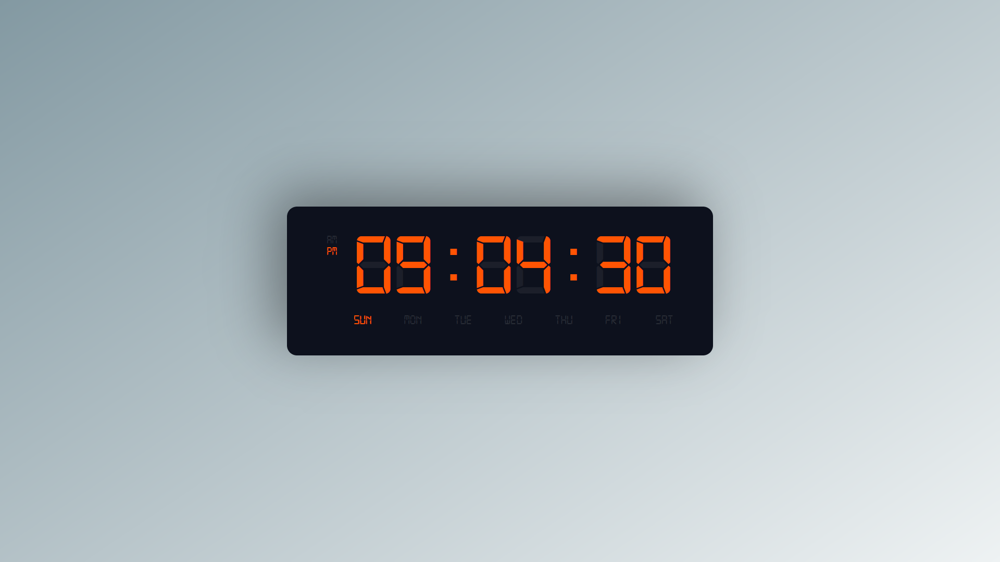

# Digital Clock

Welcome to the Digital Clock project! This application showcases a digital clock that displays the current time in a 12-hour format, complete with AM/PM indicators and a display for the days of the week. This project uses HTML, CSS, and JavaScript to create a visually appealing and functional clock.

## Table of contents

- [Digital Clock](#digital-clock)
  - [Table of contents](#table-of-contents)
  - [Overview](#overview)
    - [The challenge](#the-challenge)
    - [Screenshot](#screenshot)
    - [Links](#links)
  - [My process](#my-process)
    - [Built with](#built-with)
    - [What I learned](#what-i-learned)
    - [Continued development](#continued-development)
    - [Useful resources](#useful-resources)
  - [Author](#author)

## Overview

### The challenge

The objective was to build a digital clock that updates every second to show the current time. The clock should be in a 12-hour format with a prominent AM/PM indicator. The design also includes a display for the days of the week to add a bit of extra functionality.

### Screenshot

Here's a glimpse of the digital clock in action:



### Links

- Solution URL: [Add solution URL here](https://github.com/Rajiv-0920/Digital-Clock.git)
- Live Site URL: [Add live site URL here](https://rajiv-0920.github.io/Degital-Clock/)

## My process

### Built with

- **Semantic HTML5 markup**: Ensures clear and meaningful structure.
- **CSS custom properties**: Used for consistent theming and easy updates.
- **Flexbox**: For flexible and responsive layouts.
- **CSS Grid**: To manage the overall layout and positioning of elements.
- **JavaScript**: To dynamically update the clock every second and manage AM/PM indicators.

### What I learned

- **Time Manipulation with JavaScript**: I became proficient in using JavaScript’s `Date` object to retrieve and format the current time. Formatting hours, minutes, and seconds with leading zeros was accomplished with a simple helper function:
  
  ```js
  function doubleDigit(time) {
      return time < 10 ? "0" + time : time;
  }

- **Dynamic Class Management**: I learned how to add and remove classes dynamically based on time to indicate AM or PM. This functionality was implemented in the setAmPm function:

    ```js
    function setAmPm() {
        const date = new Date();
        let am_pm = date.getHours() >= 12 ? "pm" : "am";
        const amEl = document.querySelector(".am");
        const pmEl = document.querySelector(".pm");

        if (am_pm === 'am') {
            amEl.classList.add("active");
            pmEl.classList.remove("active");
        } else {
            amEl.classList.remove("active");
            pmEl.classList.add("active");
        }
    }
    ```

### Continued development

- **Improving Responsiveness**: I plan to further refine the clock’s responsiveness to ensure it looks great on all devices, from mobile phones to large screens.
- **Feature Expansion**: Future iterations might include features like customizable clock faces, alarms, or additional time zones.

### Useful resources

- [MDN Web Docs - Date](https://developer.mozilla.org/en-US/docs/Web/JavaScript/Reference/Global_Objects/Date): Comprehensive resource for understanding how to work with dates and times in JavaScript.
- [CSS Tricks - CSS Grid](https://css-tricks.com/snippets/css/complete-guide-grid/): A great guide for mastering CSS Grid layout techniques.

## Author

- Website - [Rajiv](https://rajiv-0920.github.io/Portfolio/)
- Frontend Mentor - [Rajiv-0920](https://www.frontendmentor.io/profile/Rajiv-0920)
- Twitter - [@rajiv_0920](https://x.com/Rajiv_0920)
